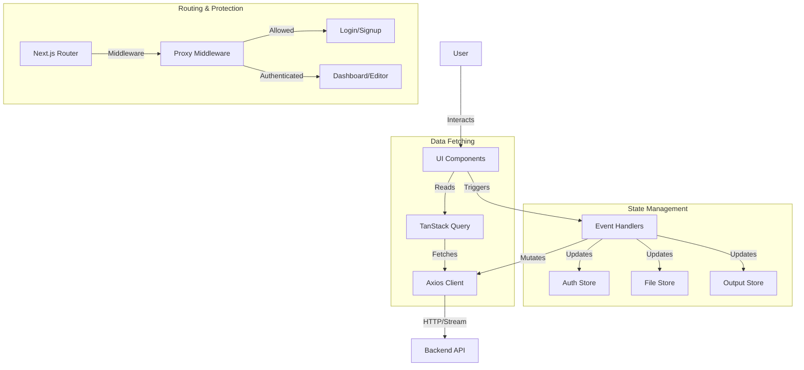

# Leplit Frontend

Leplit is a modern, web-based IDE frontend built with Next.js 16, designed to provide a seamless coding experience. It features a robust project management system, an interactive code editor, and a live output terminal.

## 🚀 Features

-   **Authentication**: Secure user login and signup flow.
-   **Project Management**: Create, organize, and manage coding projects.
-   **Code Editor**: Interactive editor for various file types.
-   **Live Terminal**: Real-time output streaming from the backend.
-   **Responsive Design**: Built with Tailwind CSS and Radix UI for a premium, accessible feel.
-   **Dark Mode**: Native dark mode support via `next-themes`.

## 🛠️ Tech Stack

-   **Framework**: [Next.js 16](https://nextjs.org/) (App Router)
-   **Language**: [TypeScript](https://www.typescriptlang.org/)
-   **Styling**: [Tailwind CSS 4](https://tailwindcss.com/)
-   **UI Components**: [Radix UI](https://www.radix-ui.com/) & [Lucide React](https://lucide.dev/)
-   **State Management**: [Zustand](https://zustand-demo.pmnd.rs/)
-   **Data Fetching**: [TanStack Query](https://tanstack.com/query/latest)
-   **Forms**: [React Hook Form](https://react-hook-form.com/) + [Zod](https://zod.dev/)
-   **HTTP Client**: [Axios](https://axios-http.com/)

## 🏗️ Architecture

The application follows a modular architecture using the Next.js App Router.

### Directory Structure

```
app/
├── (authorized)/      # Protected routes (Projects, Profile)
├── (unauthorized)/    # Public routes (Login, Signup)
├── components/        # Reusable UI components
├── hooks/             # Custom React hooks
├── lib/               # Utilities (Axios, Cookies)
├── providers/         # Global providers (Query, Theme)
├── store/             # Global state (Zustand)
└── types/             # TypeScript definitions
```

### System Data Flow



## 🚦 Getting Started

### Prerequisites

-   Node.js (v18 or higher)
-   npm or yarn

### Installation

1.  **Clone the repository:**
    ```bash
    git clone https://github.com/your-username/leplit-frontend.git
    cd leplit-frontend
    ```

2.  **Install dependencies:**
    ```bash
    npm install
    # or
    yarn install
    ```

3.  **Environment Setup:**
    Create a `.env.local` file in the root directory:
    ```env
    NEXT_PUBLIC_API_URL=http://localhost:4000
    ```

4.  **Run the development server:**
    ```bash
    npm run dev
    ```

    Open [http://localhost:3000](http://localhost:3000) with your browser to see the result.

## 🤝 Contributing

Contributions are welcome! Please feel free to submit a Pull Request.

## 📄 License

This project is licensed under the MIT License.
